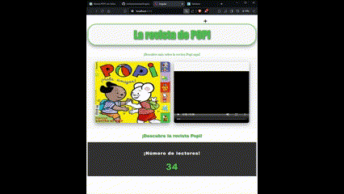

# Proyecto Popi

Este proyecto fue generado con [Angular CLI](https://github.com/angular/angular-cli) versión 17.2.1.

### Servidor de desarrollo
Ejecuta ng serve para un servidor de desarrollo. Navega a http://localhost:4200/. La aplicación se recargará automáticamente si cambias alguno de los archivos fuente.

### Creación carpetas
Ejecuta ng generate component nombre-del-componente para generar un nuevo componente. También puedes usar ng generate directive|pipe|service|class|guard|interface|enum|module.

### Construcción

Ejecuta `ng build` para construir el proyecto. Los artefactos de construcción se almacenarán en el directorio `dist/`.

### Ejecución de pruebas unitarias
Ejecuta `ng test` para ejecutar las pruebas unitarias a través de [Karma](https://karma-runner.github.io).

### Ejecución de pruebas de extremo a extremo
Ejecuta `ng e2e` para ejecutar las pruebas de extremo a extremo a través de una plataforma de tu elección. Para usar este comando, primero necesitas agregar un paquete que implemente capacidades de pruebas de extremo a extremo.

Ayuda adicional
Para obtener más ayuda sobre Angular CLI, usa `ng help` o consulta la página de Información general y [Referencia de comandos de Angular CLI](https://angular.io/cli).

---

# Codigo:

### Class HEADER:

**Parte HTML**

```html
<!-- header.component.html -->
<h1 class="titulo">La revista de POPI</h1>
<div style="text-align: center; margin-top: 20px;">
  <a href="https://www.bayardeducacion.com/revista/popi" style="text-decoration: none; color: #4CAF50; font-size: 18px; font-weight: bold;">
    ¡Descubre más sobre la revista Popi aquí!
  </a>
</div>
```

**Parte CSS**

```css
/* header.component.css */

.titulo {
  font-size: 60px; /* Tamaño de fuente aún más grande */
  font-family: 'Impact', sans-serif; /* Fuente más audaz */
  color: #4CAF50;
  text-shadow: 2px 2px 6px rgba(0, 0, 0, 0.8); /* Sombra más pronunciada */
  margin-top: 50px;
  text-align: center; /* Alineación horizontal al centro */
  padding: 20px 30px; /* Espaciado interno aumentado */
  border: 3px solid #4CAF50; /* Borde más grueso */
  border-radius: 50px; /* Bordes redondeados más grandes */
  background-color: #f9f9f9; /* Fondo ligeramente más claro para contraste */
  box-shadow: 0 8px 20px rgba(0, 0, 0, 0.4); /* Sombra más pronunciada */
  transition: all 0.4s ease; /* Transición suave más lenta */
}

.titulo:hover {
  transform: scale(1.05) rotate(-3deg); /* Efecto de escala y rotación al pasar el ratón */
  box-shadow: 0 12px 25px rgba(0, 0, 0, 0.6); /* Sombra aún más pronunciada al pasar el ratón */
}
```

### Cass BODY

**Parte HTML**
````html
<div style="display: flex; justify-content: center; background-color: #f9f9f9; padding: 30px;">
  <div style="flex: 1; text-align: center;">
    
  </div>

  <div style="flex: 1; text-align: center;">
    <video width="420" height="340" controls style="max-width: 100%; border-radius: 10px; box-shadow: 0 8px 20px rgba(0, 0, 0, 0.4);">
      <source src="../assets/video.mp4" type="video/mp4">
      Tu navegador no soporta el elemento de video.
    </video>
  </div>
</div>

<p style="font-family: 'Arial Black', sans-serif; font-size: 24px; margin: 20px 0; text-align: center; color: #4CAF50; text-shadow: 2px 2px 4px rgba(0, 0, 0, 0.3);">
  <b>¡Descubre la revista Popi!</b>
</p>
````
>[NOTE]
> En este caso no usamos CSS, todo el estilo lo damos en el propio HTML.

**Parte TypeScript**
````ts
import { ComponentFixture, TestBed } from '@angular/core/testing';

import { BodyComponent } from './body.component';

describe('BodyComponent', () => {
  let component: BodyComponent;
  let fixture: ComponentFixture<BodyComponent>;

  beforeEach(async () => {
    await TestBed.configureTestingModule({
      imports: [BodyComponent]
    })
    .compileComponents();
    
    fixture = TestBed.createComponent(BodyComponent);
    component = fixture.componentInstance;
    fixture.detectChanges();
  });

  it('should create', () => {
    expect(component).toBeTruthy();
  });
});
````

### Footer

**Parte HTML**
````html
<!-- footer.component.html -->
<footer class="epic-footer">
  <p>¡Número de lectores!</p>
  <div class="counter-container">
    <span class="epic-counter">{{ contador }}</span>
  </div>
</footer>
````

**Parte CSS**

````css
/* footer.component.css */
.epic-footer {
  background-color: #333;
  color: white;
  padding: 20px;
  text-align: center;
  font-family: 'Arial Black', sans-serif;
  font-size: 24px;
  letter-spacing: 2px;
}

.epic-counter {
  font-size: 48px;
  color: #4CAF50;
  text-shadow: 2px 2px 4px rgba(0, 0, 0, 0.5);
  animation: pulse 1s infinite alternate;
}

@keyframes pulse {
  0% { transform: scale(1); }
  100% { transform: scale(1.1); }
}
````

**Parte TypeScript**
````ts
import { ComponentFixture, TestBed } from '@angular/core/testing';

import { FooterComponent } from './footer.component';

describe('FooterComponent', () => {
  let component: FooterComponent;
  let fixture: ComponentFixture<FooterComponent>;

  beforeEach(async () => {
    await TestBed.configureTestingModule({
      imports: [FooterComponent]
    })
    .compileComponents();
    
    fixture = TestBed.createComponent(FooterComponent);
    component = fixture.componentInstance;
    fixture.detectChanges();
  });

  it('should create', () => {
    expect(component).toBeTruthy();
  });
});
````

>[NOTE]
> La actualización del contador se realiza con fixture.detectChanges(), que activa el ciclo de detección de cambios en Angular. Esto actualiza la vista para reflejar los cambios en el contador o cualquier otra propiedad del componente.

---

# Video Angular Working

## Pasos para trabajar con Angular:


#### Este ejemplo de angular se puede ver como al pasar el raton por encima del titulo se mueve, también cuenta con un hipervinculo justo debajo del titulo. Por otra parte en el body tenemos 1 imagen y 1 vídeo del producto en cuestion. Y en la zona del footer hemos añadido un contador de personas que han leido el libro.
##### ¡ESPERO QUE OS GUSTE!




  
